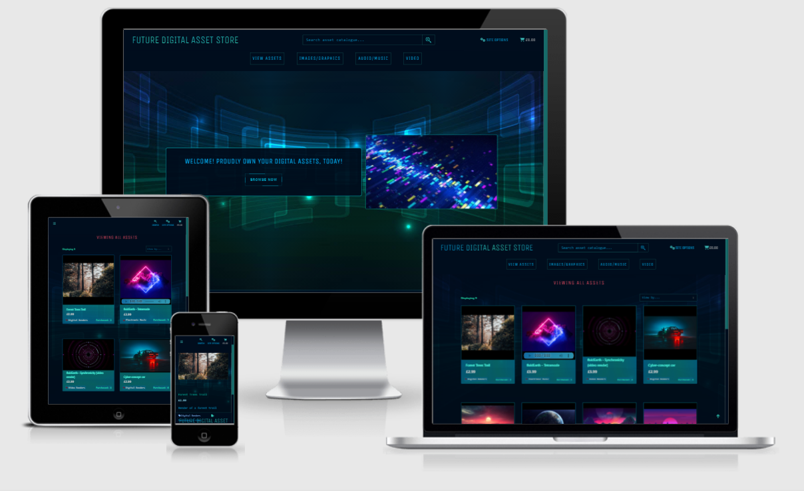

# FUTURE DIGITAL ASSET STORE

URL to the current deployed application:  [FUTURE DIGITAL ASSET STORE](https://future-digital-asset-store.herokuapp.com/)     




---

This is an e-commerce application intended to sell a range of digital assets ranging from various types of images, audio and video.   It provides an intuitive experience to browse for the desired product and provides all the key features expected of a functional e-commerce store.   This is a full stack application making use of HTML, CSS, JavaScript and Python (utilising the Django framework at the core of it with a PostgreSQL database).   

---


# UX
## Who is the audience?

The audience are people who have an interest in digital assets who may want to use the media as part of their own content creation endeavours.    

## The site owner

The site owner is a content developer and intends to use the website as a platform to feature own content.  The owner will also feature the content of others who wish to have a platform to sell their own content.   

## Typical user stories to expect:


Number | As a | I want to be able to | So that I can
--------------|---------|------------------------|-----------------
1  | Shopper | See the products available | Select and buy any of interest
2  | Shopper | Browse by the type of product I’m after | Save time and select the items most relevant to me
3  | Shopper | See details in relation to each product | Make an informed choice on price and its description
4  | Site user | Easily create an account | Access my order history and details
5  | Site user | Easily login or logout	|  Revisit the account details at any time
6  | Site user | Easily change password  | Regain access to the account
7  | Site user | Update my details on my account | Save up to date billing and delivery information
8 	| Site user | Search and sort through the products| Quickly find the products I’m interested in
9  | Shopper | View all selected items and the costs	| Make informed choices within my budget
10  | Shopper | Make changes to the selected items |	Revise my order before making a purchase
11  | Shopper | Enter my payment details	| Pay for my items securely
12  | Shopper | See a summary of my order after purchase	| Verify that the order was correct
13  | Shopper | Receive a confirmation email |	Have proof of purchase
14  | Store Owner | Add new assets	| Keep the store updated with lines
15  | Store Owner | Amend asset details	| Manage the details of products available
16  | Store Owner | Delete assets |	Remove them as they are no longer available

## Design

Due to the nature of the website in selling graphical content, the website benefits from using colours in a way that has impact yet adheres to an aesthetically pleasing style.   It needs to have a modern feel to it, make use of some modern design techniques yet maintain a minimal philosophy so that the content can be emphasised.  

### Colour Scheme

*	Hex #000d1d has been identified as a suitable color for the sidenav, top nav and footer elements
*	Hex #32d6bf70 has been identified as suitable for the borders of elements such as buttons and form inputs
*	Hex #32d6bf as a primary text color
*	Hex #00aeec as a primary text color
*	Hex #0274b8 as a secondary text color


### Fonts/typography

**Unica one** from Google Fonts has been identified as suitable for the logo and also nav buttons

**Monospace** font to be used for a retro typewriter effect on body text and form placeholders (the retro font traditionally symbolises technology as used on traditional computers)

**Roboto** font to be used for some buttons


### Icons
Fontawesome icons are used across the site to provide visual cues to support the text elements.  These icons are to be styled in accordance with the theme.

### Wireframes
The wireframes have been produced using Balsamiq and provide a visual illustration of the layout that should be adhered to.
The wireframes can be accessed [here](static/images/readme/fdas-wireframes.pdf).

### Data Schema
The data structures for this project along with the relationships have been illustrated here:


The models have been created in accordance with the above and have been migrated successfully to the sqlite3 database throughout development.  On deployment the models were migrated to the PostgreSQL database on Heroku.

---

# Features

## Existing Features

The website consists of a range of Django apps which have been developed to serve each function, with the intention of re-using them in later projects.  These apps are ‘home’, ‘assets’, ‘basket’, ‘checkout’ and ‘accounts’.  These collectively provide the core functions which address the user stories.  

### Home Page - serves as the initial landing page for all users
- Nav bar containing the logo, search bar and nav menu buttons for ‘site options’, ‘checkout’, ‘view assets’, ‘Images/graphics’, ‘audio/music’, ‘video’.
- Hero image in the main container with welcome callout, and a container for a motion graphic for visual effect.

### Login and register pages
- The login and register pages make use of the native Django templates which have been customised to adhere to the theme.  These are fully functional and represent a typical user experience for login and registration. Django allauth is used to provide the authentication system to the site. 

### Assets overview page
- The assets overview contains a grid of all the available items under the selected category.  The page defaults to all assets and this can be narrowed down to specific criteria by selecting from the nav menu which queries those categories from the database and displays them onto the page.  Each asset item is displayed in a grid layout, each containing the image, asset name, price, category, and the number of times it has been purchased.

The page also contains a sort selector which allows the user to sort by price, or by popularity (the number of times items have been purchased).    

### Individual asset page
- This page provides all the information related to the selected asset.  This includes the image, name, price, description, category, purchased number, print size selector and also a quantity form input element.   The user can then easily add the desired quantity to the basket.  The purchased item stores displays the number of times a product has been purchased (this is incremented each time a product is purchased)

### Basket page
- The basket contains a summary of all the assets which have been selected and added to it.  It provides a list of the assets including the size and quantity data.  The user can adjust the quantity (for physical products only), and also remove an item if needed.  The basket provides the subtotal for each item, the basket total, delivery cost (applied only to physical items), a discount amount if the order exceeds the discount threshold and provides the grand total.  The page displays how much the customer needs to spend in order to be eligible for the discount.  If eligible, the page will display the exact amount of saving the customer has made.

### Checkout page
- The checkout page provides a data input form for customer details for delivery (utilising Django crispy forms).   The data can be saved to the user profile if the user desires by ticking the checkbox.   The stripe payment API is integrated into the checkout and provides a seamless experience to pay for the goods.  The order summary is presented to the user so that they can analyse it before making the payment.   

### Checkout success page
- The user is directed to a checkout success page which provides an order number and a breakdown of the order and serves as proof of purchase.  The user can check that the order is correct and that the delivery details are accurate.  

### Account page
- The account page provides a Django crispy form for the user to view and update the delivery details stored in the database.   The page also provides an order history table which shows all the user’s previous orders and their details.  The user can click on an order to access the checkout summary page which provides all the details related to that order. 

### Asset management page
- The asset management page allows the admin to add new assets to the store and is another crispy form which is based on the assets model.  The admin can seamlessly enter the details and save a new asset to the database.   

### Edit asset page
- The admin user can access the edit asset page from the assets overview page or the individual asset page.  This makes it very easy and accessible to edit an existing asset in the database.  This page is a replication of the asset management page with the asset id allowing the template to populate it with the asset which requires editing. 


## Features Left to Implement

###

- Contact form to enable the customer to send queries directly from the website
- About us section to provide the user with a background to the website

Future developments:

- Allow customers to upload their own content from the account, enabling them to get paid for their content.

---

## Technologies Used

### Languages
- HTML – to structure the site and its content
- CSS – for general styling
- JavaScript – for interactivity and some data handling
- Python – for performing back-end logic
- Django template language – for programmatically rendering elements into the HTML as required.

### Libraries and Frameworks
- Django was the core framework used to develop the project for its well established libraries and functions (including AllAuth, CrispyForms, Storages, Countries
- FontAwesome was used to supply the icons
- Google fonts was used to import the required fonts
- Animate.css – to perform some animations on elements
- JQuery – to make it easier to formulate JavaScript functions and enable some bootstrap classes.
- Bootstrap was used for its grid system and to enable responsive design, also use of styling classes.
- Stripe API – to make use of the Stripe platform for payments
- Gunicorn - Python WSGI HTTP Server
- Psycopg2 – PostgreSQL database adapter for Python

### Tools
- Gitpod was used as a development environment
- Github for hosting the repository and enable version control
- Pip for installing packages as required
- Balsamiq for developing the wireframes
- AWS IAM to manage access control for AWS services
- Boto3 to enable integration with AWS from Python

### Databases
- SQlite3 – as a local database file during development
- PostgreSQL – as the final database hosted on Heroku

### Hosting
- Heroku to host the final application
- AWS S3 Bucket to host the static and media files

---
## Testing
### Validation / automatic testing

HTML validation:  I used the [W3 validator](https://validator.w3.org/) to validate the HTML and was able to rectify some minor warnings in relation to use of the aria-label attributes.   

CSS validation: I used the [W3 validator](https://jigsaw.w3.org/css-validator) to scan the CSS files for issues and it returned with no errors found.  I used an [auto prefixer](https://autoprefixer.github.io/) to add some prefixes to ensure broader compatibility, I verified the changes individually before committing them.

JavaScript validation: I used [Jshint](https://jshint.com/) to validate JS and added in a couple of missing semicolons.  There was a warning which states ‘Expected an assignment or function call and instead saw an expression’, this came from a code snippet I had obtained online from plnkr.co.  On evaluation I don’t believe this needed to be addressed as the code functions as expected and was a warning not an error.

Python validation (PEP8): I used [PEP8Online](http://pep8online.com/) to validate PEP8 compliance and came through with no issues other than a line too long in settings.py.  I’ve been informed that this isn’t necessary to address in settings.py on this occasion.  Other issues were addressed ongoing throughout development using the native pylint and flake8 tools built into gitpod.  


### Manual Testing

#### Testing against user stories:

The following user stories have been tested from the deployed version on Heroku to confirm that they function as intended.

1. See the products available 

The site grants easy access to the available products which are laid out neatly in the grid layout. The products are clear to see for the user. The user can select All Assets to view all the items in the collection.

2. Browse by the type of product I’m after 

The site allows the user to intuitively browse by category, grouped broadly into 3 types on the nav bar, Images/Graphics, Audio/Music and Video.  Each provides a menu where different categories of images, audio and video can be located.   I have tested each link and the products are queried successfully to render the relevant items onto the page.   

3. See details in relation to each product 

When a user selects an item they are taken to the asset_detail page for that item.  This page displays all the information they need to make an informed decision.   Each database entry is rendered to the page where it is supposed to be.  I tested this with items from each category to ensure that it is consistent across the site.  

4. Easily create an account

The user can create an account by selecting ‘register’ from the ‘site options’ button.  I have created various test accounts and have been successful in receiving the ‘confirm email address’ email, follow the link to activate the account successfully.  The registration form utilises Django to validate the form and provides feedback when the form isn’t valid, or when the password is not suitable.   

5. Easily login or logout

I have logged in using the various test accounts and have had the same success as the registration form (all of these forms are managed by Django Allauth and behave in the same way in terms of form validations).    

6. Easily change password

I have successfully changed passwords for the test accounts.  Django provides the functionality to perform this seamlessly and an email is sent to the user with a password reset link.  The page renders the appropriate template to allow the user to change their password.

7. Update my details on my account

The ‘account’ page can be accessed from the ‘Site options’ menu on the navbar.  The user is taken to a page where they can view the stored details on the account (prepopulated into the Django crispy form).  The user can then easily update the information before submitting with the ‘Update details’ button.  The form validates seamlessly thanks to crispyforms and I have tested by entering invalid data into the fields to receive the relevant feedback before submitting.  

8. Search and sort through the products

The user can search using the search bar at the top.  I have tested the search bar’s functionality by passing in criteria which I knew to be stored within an asset name or description, the site successfully queries the database for any matching entries. I also tried criteria which does not exist in the database to be presented with an empty page and a count of 0 matches.   I am satisfied it works as intended.  The sort feature allows the user to sort by price (low to high), or popularity (low to high).  All sort features render the items as expected.  

9. View all selected items and the costs

Once the user has selected an item, chosen quantity, and clicked ‘Add to basket’ they are given the option to ‘secure checkout’.  This takes them to the basket page where all the selected items are displayed.  The user can clearly view the subtotal for each item, the basket total, delivery cost, any discount applied and the grand total.  I have tested by processing different orders and manually calculating the costs to verify that they are calculated accurately.  I am satisfied that the basket always calculates 100% accurately.  The user can then proceed to the checkout page where this information is repeated to confirm the costs and items selected before making a purchase. 

10. Make changes to the selected items 

The user can modify quantities from the basket page and decide to remove them from the basket if needed.  I have tested these functions with all product types and categories, and I’m satisfied that it functions seamlessly.   

11. Enter my payment details

The checkout screen provides the user with a form to enter their personal details and delivery details.  The user is presented with a ‘card details’ section which accepts cards for processing with the Stripe API.  I have extensively tested this functionality by analysing the webhooks returned from stripe and cross referenced the data submitted from the site with the data that appears under event data on Stripe.   The webhook handling on site performs as expected and reliably creates orders once it is confirmed that Stripe has processed the payment.   

12. See a summary of my order after purchase

Once an order is accepted and the record is created in the database, the user is transferred to the checkout_success page where they are presented with a table which includes all the details of that order.   This page can be accessed from the user account where they can revisit this page at any time to review the details of that order.   I tested this by cross referencing the data submitted for the order versus the data which is stored on the order record.   I am satisfied that the data is valid and matches that of the initial order.  

13. Receive a confirmation email 

The email functionality works as intended in that the user receives the email template upon order completion.  This contains the details of that order and can serve as proof of purchase for the customer.   I have tested this and confirmed the data sent via email is valid and matches the initial order and the order record.

14. Add new assets

The site owner is able to seamlessly add new assets to the site from the ‘manage assets’ link under the ‘site options’.  From here, superusers are presented with a Django crispy form based on the assets model and allows them to add new entries, which are validated by default by Django (validated in accordance with the parameters within the model).    

15. Amend asset details

Each asset can be amended by clicking the ‘edit asset’ button either from the assets overview or from the individual asset pages.   This takes the user to a replication of the ‘add assets’ template only this time it is prepopulated with the data stored for that item.  The user is free to amend the details as needed and is able to update the data with ease.  The form populates accurately and also updates the entry accurately.

16. Delete assets

Deletions are easily achieved for a superuser (the delete button is positioned by the ‘edit asset’ button and can be accessed from the asset overview or the individual asset pages.  I have tested this on different product categories and I’m satisfied it deletes the specified item.   

#### Testing stripe integration

I have tried various combinations of transactions in an attempt to find any problems in the webhook handling with the Stripe API.   I am satisfied that each transaction intent is processed as required and the returned webhooks are valid and are handled successfully by the website server.  See demonstration of successful transaction below.


#### Devtools lighthouse

The devtools lighthouse evaluation came out favourably on pages throughout the site.  One factor the website administrator will need to be conscious of is the format of the images which are stored on the database, or external images URL’s.  They should be compressed, appropriately sized and of a reasonable resolution.  If large images are used for the demonstration of products, this will significantly reduce the performance score, the load times and ultimately hinder the user experience.  At a core level the website performs well when the images adhere to this standard.  Please see below:


#### Responsive testing

To test the responsiveness, I tested each page using the devtools device screen toggler to test the site on all different resolutions.  I went through each page and sweeped the range from small mobiles to desktops with large monitors. I also used the website on different browsers Chrome, Edge and Firefox for desktop.  For mobile I used chrome for android and the default Samsung browser.  Each browser behaved consistently across the devices with no issues.  I was able to identify some minor issues which were rectified easily with media queries.  I ran the tests again and found no issues which compromised the user experience.   


---

## Deployment

### Local Deployment

In your development environment of choice (I used GitPod for this project).  You’ll need to follow the following steps:

1. Clone the repository.  On GitHub, the ‘code’ button in the repository provides options for cloning.  Alternatively you can type the following command into GitPod terminal 

```
git clone https://github.com/D-Lawson/future-digital-asset-store
```
2. Set up the environment variables
    - Make an env.py file in the root directory
    - Ensure that you add env.py to the .gitignore file
    - Add the following import and variables into the env.py     

    ```
    import os  
    os.environ["DEVELOPMENT"] = "True"    
    os.environ["SECRET_KEY"] = "<ENTER SECRET KEY HERE>"    
    os.environ["STRIPE_PUBLIC_KEY"] = "<ENTER STRIPE PUBLIC KEY>"    
    os.environ["STRIPE_SECRET_KEY"] = "<ENTER STRIPE SECRET KEY>"    
    os.environ["STRIPE_WH_SECRET"] = "<ENTER STRIPE WH SECRET KEY>"     
    ```

3. Install all the required packages as detailed within requirements.txt.  You can enter the following into the terminal:

```
pip3 install -r requirements.txt
```
4. Migrate the models to set up the database with the following commands:

```
python3 manage.py makemigrations 
python3 manage.py migrate
```
5. Load the categories from the fixtures file with the following command:

```
python3 manage.py loaddata categories 
```
6. Create a superuser to access the Django admin panel:

```
python3 manage.py createsuperuser
```
7. You should now be set up to run the application locally


### Heroku Deployment
Clone the project as per the instructions in the local deployment above.
1. Create a Procfile so that Heroku can successfully run the application
`web: gunicorn dig_asset_store:application` 
2.  On Heroku, create a new app and choose a name for the application.  Select the server that is closest to where you are.      
3. On the Heroku ‘resources’ tab.  Search for Heroku Postgres in the add-ons bar, select your desired service whether it is free tier or paid, then add the PostgresSQL database to the app.
4. In GitPod, sign in to Heroku with the following command:
`heroku login -i`
5. Commit all the latest changes to GitHub then enter the following to push it to Heroku:
`git push heroku main`   
6. In Heroku settings click on Reveal Config Vars.   
7. Create the following variables:     

| KEY            | VALUE         |
|----------------|---------------|
| AWS_ACCESS_KEY_ID | `<your aws access key>`  |
| AWS_SECRET_ACCESS_KEY | `<your aws secret access key>`  |
| DATABASE_URL| `<your postgres database url>`  |
| EMAIL_HOST_PASS | `<your email password(generated by Gmail)>` |
| EMAIL_HOST_USER| `<your email address>`  |
| SECRET_KEY | `<your secret key>`  |
| STRIPE_PUBLIC_KEY| `<your stripe public key>`  |
| STRIPE_SECRET_KEY| `<your stripe secret key>`  |
| STRIPE_WH_SECRET| `<your stripe wh key>`  |
| USE_AWS | `True`  |

8. Create an env.py in the root directory and create a variable for DATABASE_URL that contains the Heroku PostgresSQL database URL. Ensure the env.py is added to .gitignore then add the following import and variable:
```
import os
os.environ["DATABASE_URL"] = 'ENTER POSTGRES DATABASE URL’`     
```
9. This should now be set up with the PostgresSQL database.  You will now need to migrate the models into the database with the following commands:    
`python3 manage.py makemigrations`     
`python3 manage.py migrate`     
10. Load the categories from the fixtures file with the following command:     
`python3 manage.py loaddata categories`      
11. Create a superuser to access the Django admin panel:
`python3 manage.py createsuperuser`     
12. Add the Heroku app to ALLOWED_HOSTS in settings.py.

#### Hosting media files with AWS
The static and media files are hosted on AWS with an S3 Bucket.  Once set up you’ll need to ensure that the AWS_ACCESS_KEY_ID and AWS_SECRET_ACCESS_KEY are entered into the config vars on Heroku.  For instructions on setting up an S3 Bucket on AWS please see the following link [Amazon S3 instructions](https://docs.aws.amazon.com/AmazonS3/latest/gsg/CreatingABucket.html)

##### Setting up the email host
An email host will need to be set up to allow Django to send emails.  You can do this from the settings of the main email providers (Gmail’s process is particularly easy).  The email provider allows you to create a special password to use with the app, this password will need to be placed in the config vars under EMAIL_HOST_PASS

---

## Credits

### Content

Core website content is limited due to the nature of the project.  All additional content is within the control of the database administrator.

### Media

Images acquired from:

[Home screen animated graphic from Giphy]( https://giphy.com/gifs/internet-computer-colorful-l3q2XB76CaWPggiNW)

### Acknowledgements 

* Code Institute's LMS provided me with a great foundation to the way I have approached this project. I made use of teachings relating to HTML, CSS, Javascript, Python, frameworks/libraries, database systems.  This project has taken inspiration from the Boutique Ado training material and has applied the teachings within.
* My mentor Guido Cecilio for providing me with feedback on the application and for assisting me in grasping concepts such as applying logic within models, debugging methods and general best practice.
* Django documentation with the templating language
* [This source code](https://embed.plnkr.co/plunk/B5waxZ) was used for the quantity +/- incrementor buttons
* This [futuristic button design](https://codepen.io/shawnrossouw/pen/qeBxxb) was used to aid UX


---

## Disclaimer

This website has been produced for educational purposes only and has no commercial intent.
